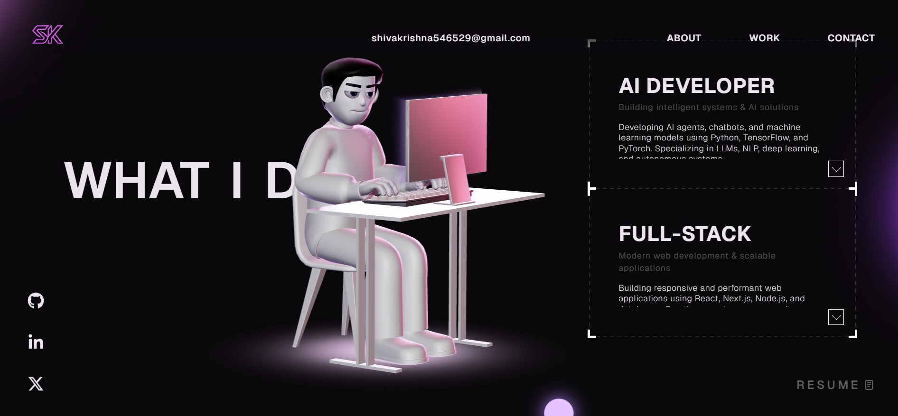

# My Portfolio Website by @red1-for-hek - Overview 🚀
This is a modern 3D portfolio website showcasing my skills as a developer. Built with cutting-edge technologies like React, TypeScript, and Three.js, it features interactive animations and a sleek design. Perfect for developers looking for inspiration or a template for their own portfolio. The project emphasizes AI and Machine Learning integrations, making it a standout example of innovation. Explore the codebase and customize it to create your unique online presence.



## File Structure 📂

```
portfolio-website/
├── public/
│   ├── images/
│   ├── models/
│   └── video/
├── src/
│   ├── assets/
│   ├── components/
│   │   ├── About.tsx
│   │   ├── Navbar.tsx
│   │   └── ...
│   ├── context/
│   ├── data/
│   ├── pages/
│   └── utils/
├── package.json
├── tsconfig.json
├── vite.config.ts
└── README.md
```

## Instructions 🛠️

### How to Run This Project Locally

1. **Clone the Repository**:
   ```bash
   git clone https://github.com/shiva12z/Portfolio.git
   ```

2. **Navigate to the Project Directory**:
   ```bash
   cd portfolio-website
   ```

3. **Install Dependencies**:
   Make sure you have Node.js installed. Then run:
   ```bash
   npm install
   ```

4. **Start the Development Server**:
   ```bash
   npm run dev
   ```
   This will start the development server. Open your browser and navigate to `http://localhost:5173` to view the website.

5. **Build for Production**:
   To create an optimized production build, run:
   ```bash
   npm run build
   ```
   The build files will be generated in the `dist` folder.

6. **Preview the Production Build**:
   ```bash
   npm run preview
   ```

### Online Preview

